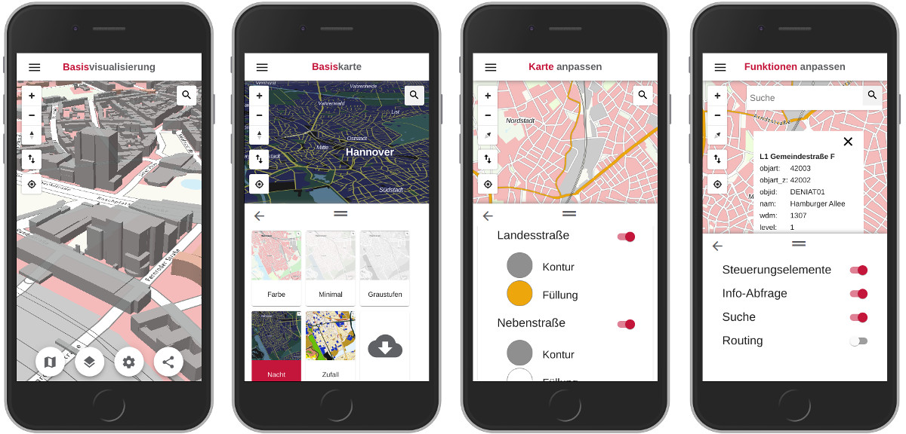

# VT Map Editor

Web editor for custom vector tile styles and map applications, based on Angular and Mapbox GL JS.



Besides VT Map Editor the Angular workspace contains an additional project "vt-map-view". VT Map View serves as simple map viewer for maps created with VT Map Editor.

## Getting Started

To set up the development environment for VT Map Editor on your local machine you can follow these instructions. You can alternatively create a Docker image as you can see below.

### Prerequisites

To get VT Map Editor up and running locally you first need to install a current Node.js LTS version and Angular CLI 8.

To be able to share map styles and map applications created with VT Map Editor you also need to set up the back-end service [VT Map Service](https://github.com/Basisvisualisierung/vt-map-service).

### Installation

For configuration options see [configuration file documentation](docs/configuration.adoc).

Open a command prompt and navigate to the project folder. Then install the dependencies:

```
npm install
```

Run VT Map Editor on port 4200:

```
ng serve
```

Run VT Map View on port 4201:

```
ng serve --project vt-map-view --port 4201
```

Build VT Map Editor and VT Map View:

```
ng build vt-map-editor --prod --base-href /vt-map-editor/
ng build vt-map-view --prod --base-href /vt-map-view/
```

## Docker

First customize the [configuration file](docs/configuration.adoc).

Open a command prompt, navigate to the project folder and build a Docker image:

```
docker build -t vt-map-editor .
```

Start a container with VT Map Editor:

```
docker run --rm --name vt-map-editor -v ${PWD}:/app -v /app/node_modules -p 4200:4200 -p 4201:4201 vt-map-editor:latest
```

Start VT Map View in the running container:

```
docker exec -it vt-map-editor ng serve --project vt-map-view --host 0.0.0.0 --port 4201
```

For a complete development environment with all related services using Docker Compose see [Docker setup](https://github.com/Basisvisualisierung/vt-map-editor/blob/master/docs/docker-setup.adoc).

## Documentation
You can find more details about the configuration and setup of the application in the [documentation](docs/vt-map-editor.adoc).

## License
Licensed under the European Union Public License (EUPL). For more information see [LICENSE.txt](LICENSE.txt).

Copyright 2020 Landesamt für Geoinformation und Landesvermessung Niedersachsen
