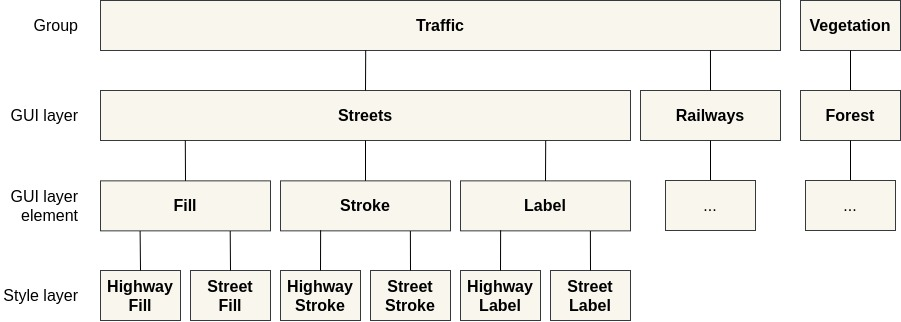
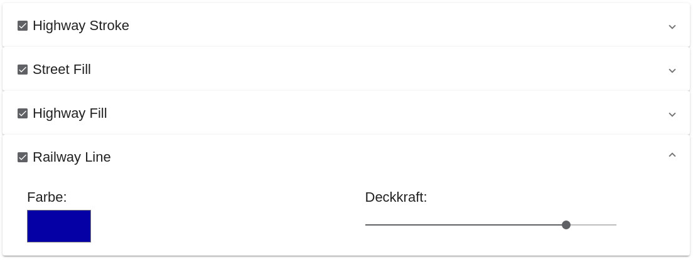
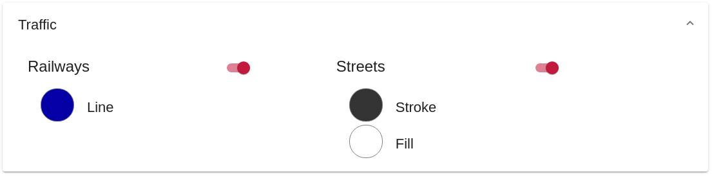

= Defining layer groups in style files

== Purpose

The look & feel of the tools for layer editing can be changed by metadata in the style files. This approach intends to present the user a user friendly and uncluttered user interface for layer editing without to many single layers. Especially for large style files this can be useful.

If a style file contains no metadata intended for VT Map Editor then the user interface of the editing tool will show all layers from the style file.

By the settings in the metadata multiple layers from the Mapbox JSON style (style layer) can be merged to a single layer shown in the graphical user interface (GUI layer). Changing the color of a GUI layer sets this color to all depending style layers. For example three style layers "River Class I", "River Class II" and "River Class III" could be shown as one layer "Rivers" in the user interface. Changing the color of the GUI layer "Rivers" will set the colors of the three layers in the style.

Each GUI layer can have multiple elements, for example a GUI layer "Streets" could have three elements "Stroke", "Fill" and "Label". For each element the color can be changed separately.

Furthermore, multiple GUI layers can be combined to a layer group. Groups affect the sorting of the GUI layers in the user interface. With metadata for groups the user interface can also be extended by sliders which can control the intensity of the group content in the map. For example by reducing a group slider "Traffic" small streets could be hidden in the map.

Example:



== Layer metadata

Each layer in the JSON style can have up to four metadata attributes.

`map-editor:group`: string

Name of the group the layer belongs to. This name is used as label in the user interface. Each GUI layer needs to be assigned to a group.

`map-editor:detail-level`: 1 - 3 (optional)

Level of detail (group slider position) at which the layer is shown in the map. This attribute is optional. Only if at least one layer in the style has this metadata attribute, the group sliders are shown in the user interface. The group sliders only affect layers with this metadata attribute. +
The value can be 1 (lowest detail level) up to 3 (highest detail level).

`map-editor:layer`: string

Name of the GUI layer to which the style layer belongs. This name is used as label in the user interface.

`map-editor:layer-element`: string

Name of the GUI layer element to which the style layer belongs. This name is used as label in the user interface.

Example:
```
"metadata": {
    "map-editor:group": "Traffic",
    "map-editor:detail-level": 1,
    "map-editor:layer": "Streets",
    "map-editor:layer-element": "Fill"
}
```

== Examples

Here you get some examples how the user interface changes by various metadata configurations in the JSON style file. The shown source codes contain only excerpts from a Mapbox style. In the examples the style has four layers. A wide dark line "Highway Stroke", overlaid by a thinner white line "Highway Fill", a layer "Street Fill" without a stroke and a fourth layer "Railway Line".

=== No metadata

None of the style layers contains metadata intended for VT Map Editor. The user interface shows all layers.

*JSON*
```
"layers": [
    {
        "id":"Highway Stroke",
        "type":"line",
        "metadata": {},
        "paint": {
            "line-width": 10,
            "line-color":"#333333"
        },
        ...
    },
    {
        "id": "Street Fill",
        "type": "line",
        "metadata": {},
        "paint": {
            "line-width": 5,
            "line-color":"#FFFFFF"
        },
        ...
    },
    {
        "id":"Highway Fill",
        "type":"line",
        "metadata": {},
        "paint": {
            "line-width": 8,
            "line-color":"#FFFFFF"
        },
        ...
    },
    {
        "id":"Railway Line",
        "type":"line",
        "metadata": {},
        "paint": {
            "line-width": 1,
            "line-color":"#0000AA"
        },
        ...
    }
]
```
*User interface*



=== Metadata without detail level

The style layers have metadata, but none of them has the attribute `map-editor:detail-level`.

*JSON*
```
"layers": [
    {
        "id":"Highway Stroke",
        "type":"line",
        "metadata": {
            "map-editor:group":"Traffic",
            "map-editor:layer":"Streets",
            "map-editor:layer-element":"Stroke"
        },
        ...
    },
    {
        "id": "Street Fill",
        "type": "line",
        "metadata": {
            "map-editor:group":"Traffic",
            "map-editor:layer":"Streets",
            "map-editor:layer-element":"Fill"
        },
        ...
    },
    {
        "id":"Highway Fill",
        "type":"line",
        "metadata": {
            "map-editor:group":"Traffic",
            "map-editor:layer":"Streets",
            "map-editor:layer-element":"Fill"
        },
        ...
    },
    {
        "id":"Railway Line",
        "type":"line",
        "metadata": {
            "map-editor:group":"Traffic",
            "map-editor:layer":"Railways",
            "map-editor:layer-element":"Line"
        },
        ...
    }
]
```
*User interface*



=== Complete metadata for all layers

The style layers have all four metadata attributes. The user interfaces first shows the group sliders. The detail button on the bottom left opens the GUI layer view.

*JSON*
```
"layers": [
    {
        "id":"Highway Stroke",
        "type":"line",
        "metadata": {
            "map-editor:group":"Traffic",
            "map-editor:detail-level":1,
            "map-editor:layer":"Streets",
            "map-editor:layer-element":"Stroke"
        },
        ...
    },
    {
        "id": "Street Fill",
        "type": "line",
        "metadata": {
            "map-editor:group":"Traffic",
            "map-editor:detail-level":2,
            "map-editor:layer":"Streets",
            "map-editor:layer-element":"Fill"
        },
        ...
    },
    {
        "id":"Highway Fill",
        "type":"line",
        "metadata": {
            "map-editor:group":"Traffic",
            "map-editor:detail-level":1,
            "map-editor:layer":"Streets",
            "map-editor:layer-element":"Fill"
        },
        ...
    },
    {
        "id":"Railway Line",
        "type":"line",
        "metadata": {
            "map-editor:group":"Traffic",
            "map-editor:detail-level":3,
            "map-editor:layer":"Railways",
            "map-editor:layer-element":"Line"
        },
        "paint": {
            "line-width": 1,
            "line-color":"#000055"
        },
        ...
    }
]
```
*User interface*


The detail button on the bottom left opens the GUI layer view.


=== Only groups defined

The style layers have metadata for groups and detail levels, but none of the style layers have metadata attributes for GUI layers. The user interface shows group sliders without the detail button. So the user can not see layer details in the user interface and can not change colors.

*JSON*
```
"layers": [
    {
        "id":"Highway Stroke",
        "type":"line",
        "metadata": {
            "map-editor:group":"Traffic",
            "map-editor:detail-level":1
        },
        ...
    },
    {
        "id": "Street Fill",
        "type": "line",
        "metadata": {
            "map-editor:group":"Traffic",
            "map-editor:detail-level":2
        },
        ...
    },
    {
        "id":"Highway Fill",
        "type":"line",
        "metadata": {
            "map-editor:group":"Traffic",
            "map-editor:detail-level":1
        },
        ...
    },
    {
        "id":"Railway Line",
        "type":"line",
        "metadata": {
            "map-editor:group":"Traffic",
            "map-editor:detail-level":3
        },
        "paint": {
            "line-width": 1,
            "line-color":"#000055"
        },
        ...
    }
]
```
*User interface*


